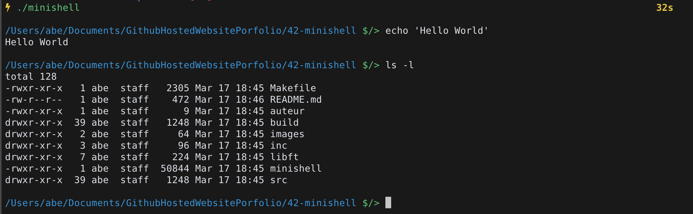

# 42-minishell

The objective of this project was for us to create the simplest start of a shellscript. As always, using our own library ([libft](https://github.com/abguimba/42-libft)).





Just a simple

```
$/> make
```
should be enough to get you started with an executable.


[Norminette subject](https://github.com/Binary-Hackers/42_Subjects/blob/master/04_Norme/norme_2_0_1.pdf)

[Every 42 subject](https://github.com/agavrel/42_Subjects)
